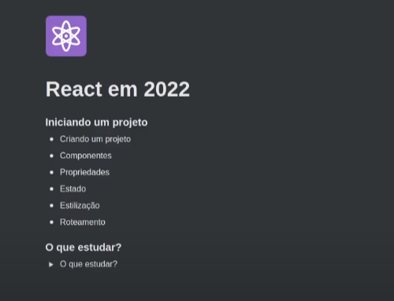

# COMEÇANDO NO REACT.JS EM 2022
## By Diego (Rocketseat)

### Links 
#### Video YouTube
- https://www.youtube.com/watch?v=pDbcC-xSat4
#### Creating new app
- https://vitejs.dev/guide/
- https://www.snowpack.dev/
#### Router
- https://reactrouter.com/docs/en/v6/getting-started/tutorial
#### CSS
##### CSS-in-JS
- https://styled-components.com/
- https://stitches.dev/
##### Tools
- https://www.radix-ui.com/
#### Data Fetching
##### Rest
- https://swr.vercel.app/
- https://react-query.tanstack.com/

###### GraphQL
- https://formidable.com/open-source/urql/
- https://www.apollographql.com/docs/react/
- https://relay.dev/

#### State Managment
- https://dev.to/ruppysuppy/redux-vs-context-api-when-to-use-them-4k3p
- https://dev.to/ibrahima92/redux-vs-react-context-which-one-should-you-choose-2hhh
- https://docs.pmnd.rs/zustand/introduction
#### Testing
- https://testing-library.com/docs/react-testing-library/intro/
#### Frameworks
- https://nextjs.org/
- https://remix.run/
- https://www.youtube.com/channel/UC1PUtdA_NktdtmRpF_UGG_w

